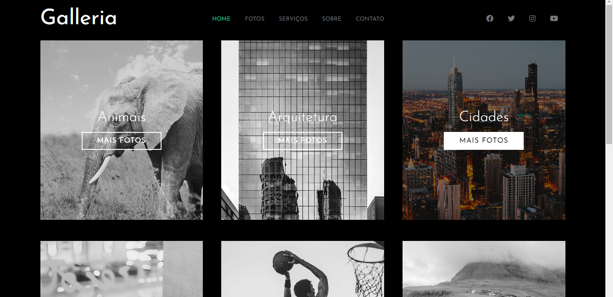

<h1 align="center"> Galleria </h1>

  <a href="#-tecnologias">Tecnologias</a>&nbsp;&nbsp;&nbsp;|&nbsp;&nbsp;&nbsp;
  <a href="#-projeto">Projeto</a>&nbsp;&nbsp;&nbsp;|&nbsp;&nbsp;&nbsp;
  <a href="#memo-licença">Licença</a>

  

 

  

## 🚀 Tecnologias

Esse projeto foi desenvolvido com as seguintes tecnologias:

- Saas
- HTML

## 💻 Projeto

Galleria é um projeto que consiste em uma layout estático que foi criado para treinar e estudar as funcionalidades do SASS um pré-processador CSS. Em breve, pretendo aproveitar o layout já construído para adicionar outras features ao projeto. Caso queira colaborar, não hesite em abrir um Pull Request.

## :memo: Licença

Esse projeto está sob a licença MIT.

---

Feito com ♥ by Luiz :wave:
